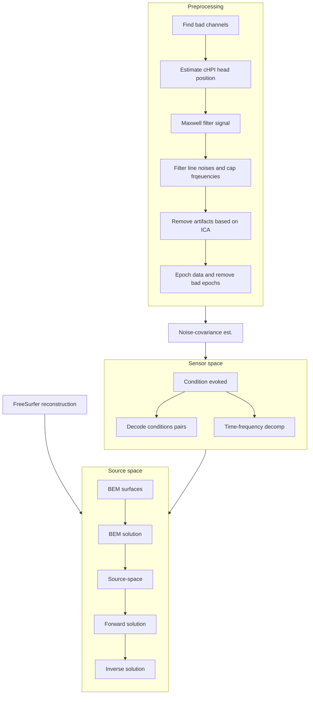

The data processing pipeline is fully automated for the core, common steps leading to source space analysis. This majority of this pipeline heavily uses the `mne-bids-pipeline` tool, which helps automate everything so long as the data are in BIDS compatible format.

The pipeline can be chunked into several discrete processes, with each of those having steps within of processing the data:

Each step in the pipeline saves intermediate results in the BIDS format for use in subsequent analyses. Those subsequent analyses will be detailed later on here once needed.