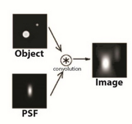

# Hauk, Stenroos and Treder Source reconstruction method eval

In brief:

- Tutorial on MNE and beamforming methods
- Two key metrics for evaluating a given method
  - Peak localization error: distance between estimated peak and true location in point-spread function (PSF) or cross-talk function (CTF)
  - Spatial deviation: The standard deviation around the peak of the distribution for PSF and CTF
- 

## Methods and definitions

#### The forward and inverse models

In a system that is roughly linear, if the inputs can be approximated as a sum of point sources we can also approximate the output as a sum of the individual sources and "point spread functions." One such example is a microscope:

The same properties can be applied to M/EEG data in signal space. In this case the equivalent of the point spread function is the resolution matrix, which describes the relationship between a set of point sources and the observed signal in our system.

Formally we can describe the problem as:
- for an observed sensor signal $\mathbf{d} \in \mathbb{R}^{m \times 1}$
- for a true point source set $\mathbf{s} \in \mathbb{R}^{n \times 1}$
- for _leadfield matrix_ which expresses the transformation to sensors $\mathbf{L} \in \mathbb{R}^{m \times n}$
- for a sensor noise term $\mathbf{e} \in \mathbb{R}^{m \times 1}$

allows us to express the sensor signal as the following, which is our **forward model**:

$\mathbf{d} = \mathbf{L}\mathbf{s} + \mathbf{e}$

This signal can be used to generate an approximate inverse, estimating the signal $\mathbf{s}$ as $\mathbf{\hat{s}}$, via a fitted **inverse matrix** $\mathbf{K} \in \mathbb{R}^{n \times m}$ sometimes referred to as the kernel. This transforms the sensor signals $\mathbf{d}$ into source estimates:

$\mathbf{\hat{s}} = \mathbf{K} \mathbf{d}$

We can break this down into a resolution matrix and a noise term as per our original expression of $\mathbf{d}$:

$\mathbf{\hat{s}} = \mathbf{K}\mathbf{L}\mathbf{s} + \mathbf{K}\mathbf{e} = \mathbf{R}\mathbf{s} + \mathbf{K}\mathbf{e}$

which expresses the change from a known point source to the estimated source values as a sum of the noise, transformed by our kernel, and the original point signal multiplied by a _resolution matrix_ $\mathbf{R} \in \mathbb{R}^{n \times n}$. **The resolution matrix is a combination of our forward model leadfield and inverse model transform**.

#### The point-spread function (PSF)

The PSF is simple an expression of the resolution matrix, defined above, applied to a source $i$ of unit strength. This equated to the $i^{\text{th}}$ column of the resolution matrix and leadfield matrix:

$\mathbf{PSF}_i = \mathbf{R}_i = \mathbf{K}\mathbf{L}_{.i}$

which is just a weighted sum of inverse matrix by the leadfield matrix, **expressing the activation of a single source spreads among other sources if it is the only active point.**

#### The cross-talk function (CTF)

Conversely the cross-talk function describes how all points besides $i$ affect the the estimate at that source location. It can be defined as the $i^{\text{th}}$ row of the inverse matrix multiplied by our leadfield matrix:

$\mathbf{CTF}_i = \mathbf{K}_{i.}\mathbf{L} = \mathbf{R}_{i.}$

Which expresses the relationship in our inverse model for that source $i$ with all other sources in our model, and how much they affect each other. 

Note that **both PSD and CTF are expressed in the source space: they are vectors of length $n$ relating a given point source $i$ to all other sources.**. They differ in what they represent.

