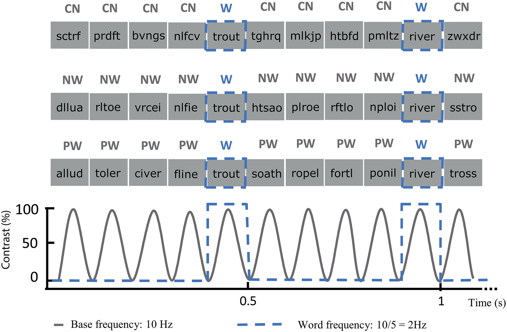
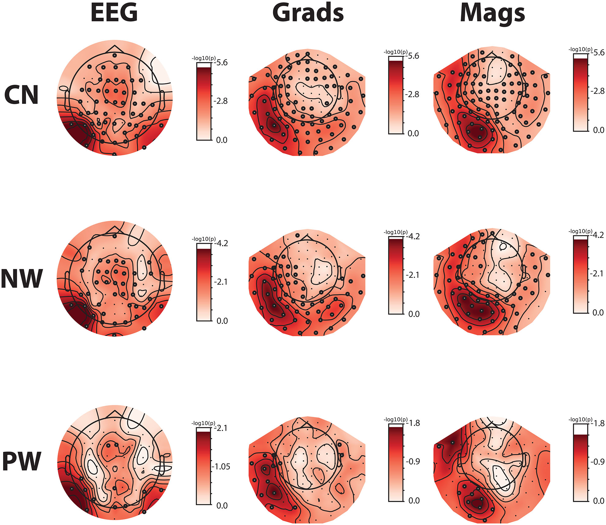

# Word FPVS in EEG/MEG Source Space

### Summary

This paper sought to extend the results of [[Lochy et al 2015]] to the English language, following a failure to replicate those results in a smaller study by [Barnes et al 2021](https://www.frontiersin.org/journals/neuroscience/articles/10.3389/fnins.2021.602798/full) with 10 participants.

They used an identical oddball paradigm (10 Hz base, 2 Hz oddball) to present words interspersed among either:
- constant strings (CN)
- pseudo-words (PW) which could be pronounced
- non-words (NW) consisting of the pseudo-words with shuffled letters as to be unpronounceable.

Notably a color-change detection task was included during the experiment to maintain attention of the participants on the stimuli.

Data were recorded in a MEGIN system (same as FCBG) with MEG/EEG, and structural MRI was also acquired. Source reconstruction was performed and data were analyzed in both signal and sensor space. Following baseline-correction using a metric similar to SNR (see [methods notes](#notes-on-methods) for details) a Z-score per sensor or vertex was computed. 

Significance was determined using a cluster-based permutation test, as standard, and found that words produced a significantly different response in all three conditions for all three types of sensor (EEG/MEG-Grad/MEG-Mag):

Circled sensors were found to be significant for the oddball frequency response.

The source space showed similar results, with significance in all three conditions with a gradient of strength CN > NW > PW. Note that they indicate vOTC (not easily visible in the below figure, but was noted in the text), a.k.a VWFA, was included in all three conditions!

![[./assets/imag_a_00414_fig5.jpeg]]

Finally, the data showed a strong lateralization of this sensitivity particularly when compared against the baseline frequencies. Not all subjects showed a strong lateralization but the general trend was established. Below are the Z-scores for many ROIs in the source space in the L/R hemispheres. The left column shows the Z-score for the oddball frequency, while the right shows the Z-score for the baseline frequency.

![[./assets/imag_a_00414_fig7.jpeg]]

Similar plots were shown for the sensor data which also show a lateralization in all MEG data but much less so in EEG data. 70-95% of participants showed left lateralization depending on the condition and sensor type, while the baseline frequency consistently showed near 50% (chance) left lateralization.

Overall an encouraging result for reliably performing FPVS studies in English, and established that VWFA can indeed be found in the source space using normal and standard methods via FPVS.

### Notes on methods

- The recording set-up is almost identical to the one available at FCBG
- Each run of stimuli lasted 60 seconds, excluding 2 seconds of fade in and fade out at either end of the trial.
- Data were MaxFiltered and ICA was performed for heartbeat/eye-movement removal (maximum 4 components). Notch filter at 50/100 Hz, low-pass at 140 Hz (seems high?)

The frequency-space analysis used a method from the Lochy paper I didn't recall:
1. FFT was divided into segments of 0.75 Hz each (centered at frequency of interest and harmonics) and the the segments were summed across 10 harmonics
2. The amplitude of 10 neighboring frequency bins in the FFT (skipping one on either side) was averaged and that value subtracted from each segment of interest at the tag freq/harmonics. NB: the min and max of these neighbors was also removed.
3. Z scores for the word-selective and base frequencies were computed by dividing the baseline-corrected amplitudes by the SD of the neighboring bins

This Z-scoring allows for comparison even between sensor modalities.

