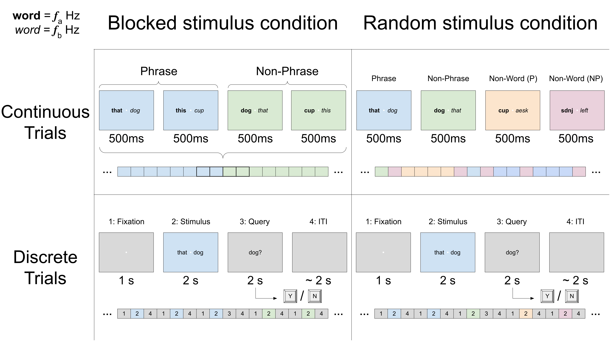

Originally we planned to use two possible regimes for presenting stimuli: a "discrete" structure with defined fixation/stimulus/query/ITI periods, and a "continuous" structure in which stimulus pairs rapidly followed one another in sequence. 

This dichotomy, coupled with the possibility of interleaving or blocking conditions, led to four possible task structures:

While we initially settled on the bottom-right quadrant task with discrete trials of random category, the necessity of a finer frequency resolution than the 2 second window of stimulus presentation allowed meant that the task had to be shelved in favor of the mini-block task that allowed for separating conditions while extending the duration of frequency-tagged stimuli.

The [Mini-block Task](Mini-block%20Task.md) can be considered an extension of the upper-left option, in which there are queries separating the blocks of stimuli from one another as well as a defined fixation period and ITI.