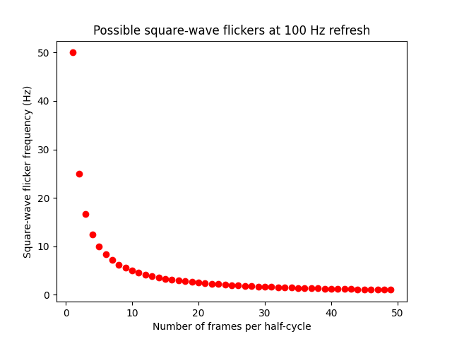
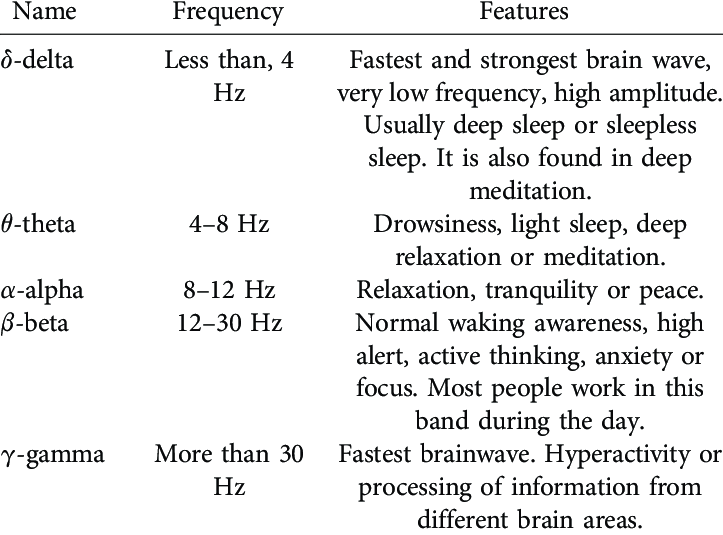
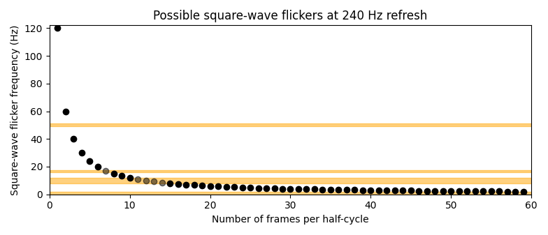

Frequency tagging is a delicate process, and requires precise timing of updates to stimuli to ensure stable flickering at a given rate. 

It is possible to perform sine-wave frequency tagging or square wave frequency tagging. The former smoothly changes the intensity of a stimulus, the latter turns the stimulus on and off.

**We chose square-wave tagging** as it allows for reliable flickering at high tag frequencies close to the refresh period of the display. 

## Choosing tagging frequencies: A primer on refreshing

At a single refresh rate $F_r$ the interval between updates is $\tau_r = \frac{1}{F_r}$ . This means that we can only change the state of the stimulus every $\tau_r$ seconds.

Because of this limitation, we are restricted to a maximum tagging frequency of $\frac{F_r}{2}$ for the stimulus, as we must update the stimulus twice per cycle: once to turn it on and again to turn it off halfway through the cycle.

Furthermore, we are limited in our tagging frequency options if we want equal-length on and off cycles for the stimulus. This is because the tagging frequency $F_i$ must have a half-cycle duration $\tau_{\text{half}} = \frac{1}{2F_i}$ that is a multiple of the base refresh period $\tau_r$ .

This is because within a single cycle of our tag we only have $\frac{\tau_i}{\tau_r}$ refresh periods, where $\tau_i$ is the full period of the frequency tag. This means two things:
1. The number of refresh periods per tag cycle must be a whole number. Otherwise we can't change the stimulus at the right time to meet our frequency tag.
2. The mid-point of the cycle, where the stimulus should switch from on to off or vice-versa, needs to also match up with a refresh of the display. This means that we need an even number of display refreshes in the cycle period $\tau_i$.

Let's look at a few options to understand this better. To begin with, let's consider a monitor that refreshes at 100 Hz and therefore has a 0.010 second (10 ms) refresh period. 
- The first possible square-wave flicker is 50 Hz: a single 10 ms on period and another 10 ms off period for a total of 20 ms.
- The next possible flicker is at 25 Hz! This is because if we want to match the on/off we now need two periods each, for a total of 40ms.
- The next after 25Hz is 16.667 Hz, etc.

The set of possible flickers forms an inverse relationship with the number of half-cycle frames. This means that while there are a great number of possible tag frequencies below 10 Hz, the refresh rate of the display governs how sparse the remaining space is at higher frequencies:

This is complicated by the fact that we must consider several bands of activity in M/EEG recordings which could vary activity based on the task we provide our subjects, their mental state, or other undesirable factors:

Barsy, B. G., Győri, G. & Szemes, P. T. Development of EEG measurement and processing system in LabVIEW development environment. _International Review of Applied Sciences and Engineering_ **11**, 287–297 (2020).

We also would like to avoid these bands not only with the frequency tags themselves, but also with the **intermodulation frequencies** which might appear as a combination of two tags in regions integrating those stimuli. Common combinations include:
- $\mathbf{f}_1 + \mathbf{f}_2$
- $\mathbf{f}_2 - \mathbf{f}_1$
- $\mathbf{f}_1 - \mathbf{f}_2$
- $2\mathbf{f}_1 + \mathbf{f}_2$
- $\mathbf{f}_1 + 2 \mathbf{f}_2$
- $2\mathbf{f}_1 - \mathbf{f}_2$
- $2\mathbf{f}_2 - \mathbf{f}_1$

## Our frequencies: Criteria and decision

We will define our tagging frequencies in both Hz and in terms of the number of refresh periods (_display cycles_ from hereon) for clarity.

Given the above information, we have the following frequency bands we want to avoid for both the tags and possible IM frequencies:
- 0 - 2 Hz because of difficulties in capturing such slow fluctuations in limited sample size
- 8 - 12 Hz $\alpha$ band activity due to association with processing of visual information in memory
- 16.6667 Hz due to local line noise from nearby train pantographs (3-phase 50 Hz)
- 50 Hz due to power line noise

At the refresh rate of 240 Hz for the ProPixx device available to use, the following plot shows all possible frequencies with the above bands marked:

The 240Hz refresh rate translates to a display cycle period of $4.1\bar{66}$ ms.

We have a good number of candidates at this point, but we must now filter on the possible IM frequencies above also avoiding our undesirable bands. After doing so, we settled on:

### Final tag frequencies
**Frequency 1:** 17.14286 Hz or 14 display cycles

**Frequency 2:** 20 Hz or 12 display cycles

The possible intermodulation frequencies, as above, are then:

| $\mathbf{f}_1 + \mathbf{f}_2$ | $\mathbf{f}_2 - \mathbf{f}_1$ | $2\mathbf{f}_2 - \mathbf{f}_1$ | $2\mathbf{f}_1 - \mathbf{f}_2$ |
| ----------------------------- | ----------------------------- | ------------------------------ | ------------------------------ |
| 37.14286                      | 2.85714                       | 22.85714                       | 14.2857                        |

All of these are outside of our ranges of exception and fit our needs.

