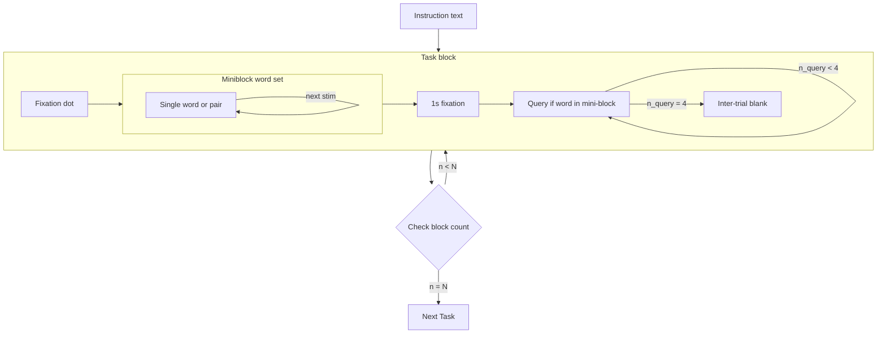
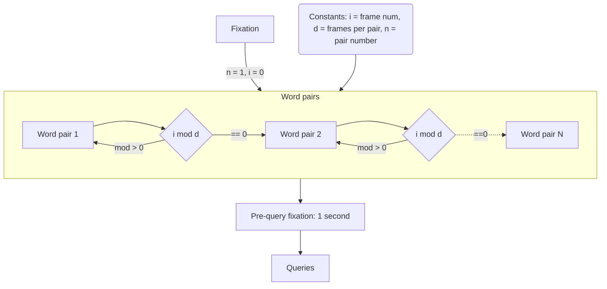
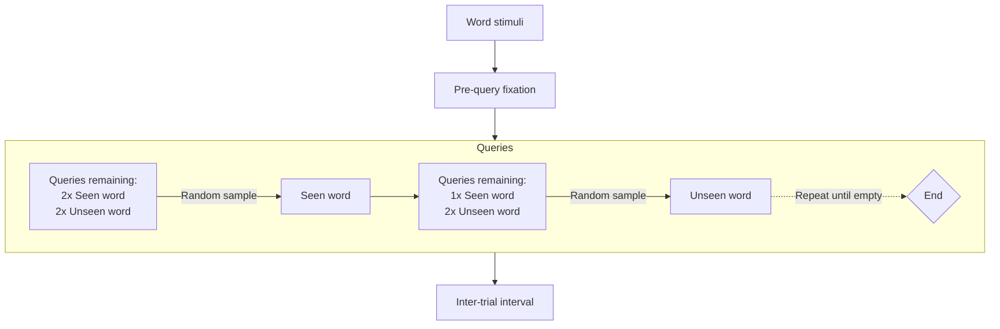

### Mini-blocks
The mini-block task uses a structure with discrete blocks of $K$ stimuli presented for $\tau$ seconds each, for a total display time of $T = \tau K$ . 

#### Frequency tags
Frequency tags are preserved within a mini-block, such that the frequency does not change. If the left frequency tag in a pair is $\mathbf{f}_L = \mathbf{f}_1$ then the left tag will remain $\mathbf{f}_1$ the full trial.

#### Motivation for mini-blocks

##### Frequency precision
The choice of using a mini-block of stimuli is due to the precision of the Fourier transform on a sample of data. For a sampling rate $F_s$ and number of samples $N$  the maximum width of a bin in the FFT is $\frac{F_s}{N}$ , which amounts to a width of $\frac{1}{\tau}$ for a fixed sample rate and stimulus duration $\tau$ .

At the original 2-second stimulus duration of the [discrete task](discrete%20task) this results in a bin width of only 0.5 Hz, which is extremely coarse for the purpose of finding frequency tags.

By combining multiple stimuli into a single presentation, we effectively increase our sample size for the Fourier transform. This means that our bin width goes from $\frac{1}{\tau}$ to $\frac{1}{K\tau}$, providing a substantial increase in granularity.

##### Stimuli without onset effects
This has the added effect of also providing many samples of stimuli for which the initial onset response to the stimulus (when the text initially flicks on) is not present. This usually takes the form of a brief peak in the evoked response. For all stimuli after the first this won't be there.

##### Possible issue: mixing categories
Stimuli in a mini-block will be analyzed together. This means that the PSD/FFT will be run on the full set of stimuli for the precision mentioned above. As such, mixing stimulus categories will mean that we can't make conclusions about our data since we can't separate the effects of different category (word, non-phrase, non-word) stimuli within the mini-block.

#### Stimulus display

#### Query logic

